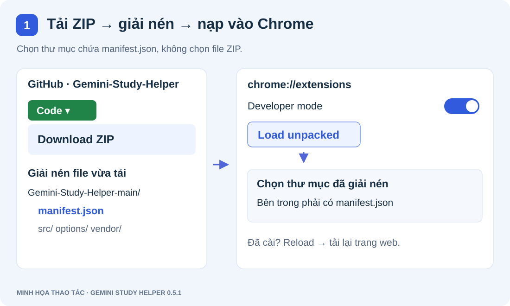
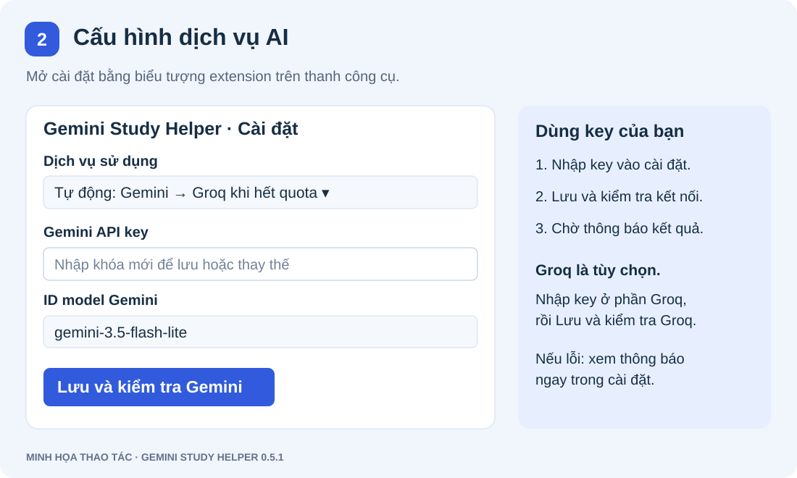
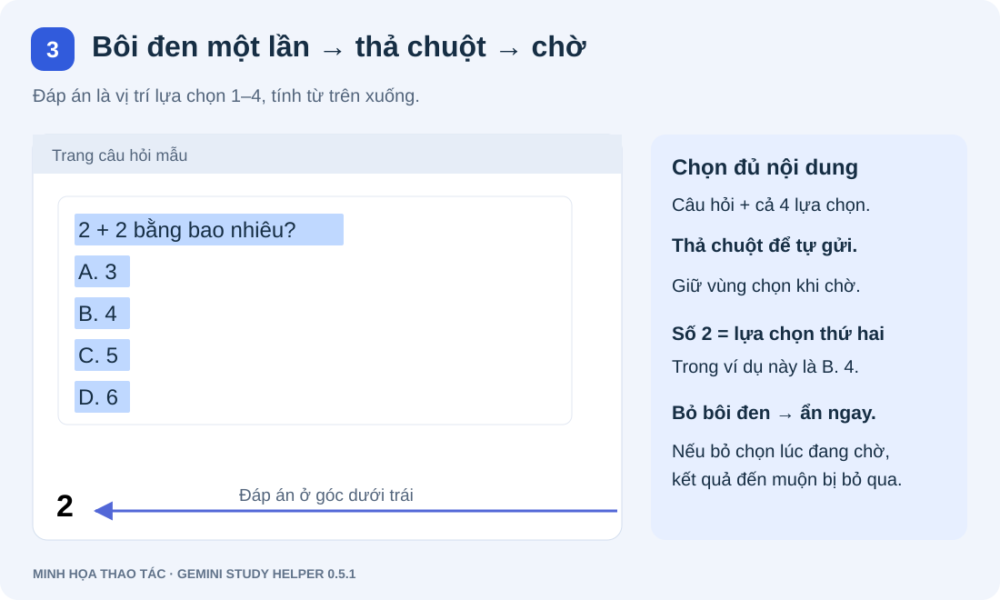

# Gemini Study Helper

Nguồn ban đầu: [nchh06/Web-Question-Assistant](https://github.com/nchh06/Web-Question-Assistant). Bản này bổ sung và sửa cơ chế bôi đen, giao diện, tài liệu tham chiếu và kết nối Gemini/Groq. PDF.js đóng gói trong `vendor/pdfjs` giữ nguyên giấy phép và thông báo của thư viện.

Extension Manifest V3, JavaScript thuần: bôi đen câu hỏi **một lần** để tự tra cứu Gemini/Groq khi thả chuột. Không cần Alt+Q, chọn lần hai, Enter hoặc nút gửi. Từ bản **0.4.0**, đáp án hợp lệ chỉ là **1, 2, 3 hoặc 4 theo thứ tự lựa chọn từ trên xuống**, chữ đen, nền trong suốt ở góc dưới trái. **Bỏ bôi đen** hoặc nhấn **Esc** để đóng.

## Bắt đầu bằng hình ảnh

Các hình dưới đây là minh họa thao tác, không chứa API key hay thông tin tài khoản. Tên nút có thể khác theo ngôn ngữ của Chrome.

### 1. Tải và cài extension

Trên repo, chọn **Code → Download ZIP**, giải nén. Mở `chrome://extensions`, bật **Developer mode**, chọn **Load unpacked** và chọn thư mục có `manifest.json`. Nếu cập nhật bản cũ, bấm **Reload** rồi tải lại trang web bằng **⌘R** trên Mac hoặc **Ctrl+R** trên Windows.



### 2. Lưu API key và kiểm tra kết nối

Bấm biểu tượng extension để mở cài đặt. Nhập key riêng của bạn và bấm **Lưu và kiểm tra Gemini**. Nếu dùng Groq, nhập key tại phần **Kết nối Groq**, bấm **Lưu và kiểm tra Groq** rồi chọn chế độ sử dụng và lưu. Muốn tự động dự phòng, chọn **Tự động: Gemini → Groq khi hết quota** và lưu cả hai key. Không nhập key vào trang câu hỏi.



### 3. Bôi đen một lần, giữ vùng chọn để xem đáp án

Kéo chọn **cả câu hỏi và đủ bốn lựa chọn**, rồi thả chuột. Giữ vùng chọn trong lúc chờ; đáp án **1–4** hiện ở góc dưới trái, tương ứng thứ tự lựa chọn từ trên xuống. **Bỏ bôi đen sẽ ẩn đáp án ngay**, kể cả khi AI chưa trả lời. Nếu không hiện kết quả, mở cài đặt và xem **Lần tra cứu gần nhất**; trong lúc chờ, chọn thêm không gửi yêu cầu mới.



## Bản 0.5.1 — Gemini 3.5 Flash-Lite + Groq

Gemini chính mặc định là `gemini-3.5-flash-lite`, dùng `thinkingLevel: minimal` đúng theo model. Khi reload bản này, nếu cấu hình đang là mặc định cũ `gemini-3.8-flash` hoặc chưa có model, extension đổi một lần sang Flash-Lite và yêu cầu kiểm tra kết nối lại. Không đọc/ghi lại key trong bước chuyển; model tùy chỉnh khác được giữ. Chọn chế độ **Tự động** để Gemini chính và Groq dự phòng; nếu đang chọn **Chỉ dùng Groq**, cần đổi chế độ và Lưu. Gemini key hiện tại dùng được cho model mới nếu project có quyền/quota; tạo key khác cùng project không thêm quota.

## Bản 0.5.0 — Groq và dự phòng khi Gemini hết quota

- Dịch vụ: **Tự động (Gemini → Groq)**, **Chỉ dùng Groq**, **Chỉ dùng Gemini**. Tài khoản đã lưu Gemini key vẫn dùng được; Groq key là tùy chọn. Để dùng Groq miễn phí trực tiếp, chọn Chỉ dùng Groq.
- Tạo Groq key tại https://console.groq.com/keys rồi nhập **Groq API key**, bấm **Lưu và kiểm tra Groq**. Model cố định `qwen/qwen3.8-27b`, reasoning tắt để giảm độ trễ/token. Hai nút kiểm tra độc lập: test Gemini không chuyển sang Groq để tránh báo thành công sai nhà cung cấp.
- Tự động chỉ chuyển khi thiếu Gemini key hoặc Gemini báo quota/rate limit/resource exhausted. Không chuyển khi key sai, thiếu quyền, timeout/mạng (request có thể vẫn được xử lý), dữ liệu thiếu hoặc AI không chắc đáp án.
- Mỗi thao tác chọn gửi một message; tối đa một lần sinh đáp án mỗi nhà cung cấp, tuần tự. Khi Gemini bị quota, có thể có một lần bị từ chối ở Gemini rồi một lượt Groq. Không gửi hai nhà cung cấp song song. Trong cùng phiên worker, tạm bỏ qua Gemini 5 phút sau lỗi quota hoặc 1 phút sau lỗi tốc độ/429 chưa rõ; lượt bị bỏ qua không kéo dài thời hạn. Lưu cấu hình hoặc restart worker xóa thời gian tạm bỏ qua.
- Groq gọi `POST https://api.groq.com/openai/v1/chat/completions`, `Authorization: Bearer` chỉ trong background. Hai key không trả về trang web/giao diện/log, ô password trống sau lưu. Xóa key nào chỉ ảnh hưởng key đó; lưu ô trống giữ key cũ. Không đóng gói key trong ZIP.
- Câu hỏi và tài liệu vẫn là JSON dữ liệu trong user message; hướng dẫn riêng trong system message. Chỉ chấp nhận `1/2/3/4`, không lấy số từ lời giải. Không tự ép response không xác định/sai định dạng.
- Groq chưa có luồng countTokens ở đây: kiểm tra toàn bộ thông điệp bằng số byte UTF-8 + 512 token dự phòng làm cận trên an toàn, trần 16.000; cộng tối đa 64 token đầu ra thấp hơn context 131.072 của model. Vượt trần bị từ chối và báo độ phủ tài liệu, không cắt thêm. Sau phản hồi, báo `usage.prompt_tokens` thực tế nếu được cung cấp. Giao diện phân biệt rõ độ dài request và quota ngày.
- Groq Free còn giới hạn request và token/phút/ngày theo tổ chức. Không cam kết 40 câu luôn thành công, độ chính xác, model luôn sẵn có hoặc quota không đổi. Không xoay key cùng project/tổ chức để né hạn mức.

## Cài đặt / reload

1. Chrome, Edge, Cốc Cốc: mở `chrome://extensions` hoặc trang extensions tương ứng, bật **Developer mode**. Chọn **Load unpacked** và trỏ tới chính thư mục có `manifest.json`. Không cần build hoặc npm install; PDF.js đã đóng gói cục bộ.
2. Nếu đang dùng phiên bản cũ: bấm **Reload** trên thẻ extension. Chấp nhận quyền mới nếu trình duyệt yêu cầu. **Tải lại trang web cần sử dụng** để content script mới có hiệu lực; tab mở từ trước không tự nhận mã mới.
3. Bấm biểu tượng extension để mở cài đặt. Nhập Gemini API key, kiểm tra ID model (mặc định `gemini-3.5-flash-lite`), chọn **Lưu và kiểm tra Gemini**. Khóa nhập được xóa khỏi ô sau khi lưu; khóa đã lưu không được trả lại giao diện.
4. Firefox hiện hành: `about:debugging#/runtime/this-firefox` → **Load Temporary Add-on** → chọn `manifest.json`; dùng Reload khi sửa. Cần nạp lại add-on tạm sau khi khởi động lại Firefox. Bản này chưa được kiểm tra trực tiếp trong Firefox.

## Tra cứu

Chọn **cả câu hỏi và đủ bốn lựa chọn**. Với đề không có nhãn, câu hỏi rồi bốn lựa chọn cần nằm trên năm dòng không rỗng; hoặc năm khối cách nhau bằng dòng trống nếu mỗi phần có nhiều dòng. Ví dụ:

```text
2 + 2 bằng bao nhiêu?
3
4
5
6
```

Ví dụ trên hiển thị **2**. Đề có nhãn `A.`, `A)`, `A:`, `(A)` (tương tự B/C/D) hoặc `1.`, `1)`, `1:`, `(1)` (tương tự 2/3/4) vẫn được đọc, nhưng kết quả luôn là vị trí 1–4, không phải nhãn gốc. Ví dụ `D. Trái Đất`, `B. Sao Hỏa`, `A. Sao Kim`, `C. Sao Thủy` thì Trái Đất là **1**. Giữ nguyên thứ tự trong vùng chọn; không tự sắp xếp lại nhãn. Không hỗ trợ mọi bố cục: lựa chọn không có nhãn bị gộp thành một dòng, có số lựa chọn khác bốn hoặc xuống dòng không rõ ràng sẽ bị từ chối.

Bôi đen đủ nội dung rồi thả chuột: extension tự gửi một yêu cầu. Không gửi trong lúc đang kéo và không tính nhiều sự kiện `selectionchange` thành nhiều yêu cầu. Bấm lên vùng chọn còn nguyên không gửi lại. Có hỗ trợ chọn bằng Shift + phím điều hướng và Ctrl/Cmd+A, gửi khi kết thúc thao tác chọn (thả Shift hoặc phím A).

Trong lúc chờ, thao tác chọn thêm bị bỏ qua để không gửi trùng, không xếp hàng; khi yêu cầu hoàn tất hoặc lỗi, bôi đen một lần cho lượt tiếp theo. Không chuyển focus hoặc sửa vùng chọn khi nhận đáp án.

Khi vùng chọn bị xóa hoặc đổi, đáp án biến mất ngay trong sự kiện `selectionchange`. Phản hồi chỉ hiện nếu đúng vùng chọn của yêu cầu vẫn còn; bỏ chọn rồi chọn lại cùng chữ cũng không làm phản hồi cũ xuất hiện. Kiểm tra lại vùng chọn ngay trước khi hiển thị để xử lý sự kiện đến chậm. Bỏ chọn không hủy HTTP đã gửi: Gemini có thể vẫn xử lý và dùng quota, nhưng kết quả đến muộn bị bỏ qua. Kết quả mới hợp lệ thay thế kết quả cũ. Trang web không hiện dòng tải, lỗi, khung, bóng, tiêu đề hoặc nút. Biểu tượng extension hiện `…` khi xử lý, `!` khi lỗi; xem chi tiết trong cài đặt. Esc cũng ngăn phản hồi đang chờ mở lại kết quả.

Chỉ xử lý phần chọn trong tài liệu HTML chính trên HTTP/HTTPS, tối đa 8.000 ký tự; không đọc toàn trang, ô nhập, vùng chỉnh sửa, iframe, PDF viewer, URL `file:` hoặc trang nội bộ/bị trình duyệt hạn chế. Thiếu câu hỏi/lựa chọn, đáp án không xác định, nhiều đáp án, phản hồi bị chặn/cắt hoặc sai định dạng đều không được ép thành một chữ cái.

## Tài liệu tham khảo

- Dán văn bản có tên hoặc tải nhiều PDF/TXT UTF-8 ở cài đặt. Mỗi tài liệu có trạng thái đọc, số ký tự và nút xóa. Thêm tài liệu chỉ lưu cục bộ.
- PDF.js đọc **lớp văn bản**, không OCR và không đọc nội dung ảnh/biểu đồ. PDF chỉ có ảnh bị từ chối. PDF hỗn hợp được lưu phần trích xuất, báo số trang có văn bản và các trang chưa đọc được. Không tuyên bố đã đọc toàn bộ PDF.
- Giới hạn: 12 tài liệu, 10 MB/tệp, 200 trang/PDF, 300.000 ký tự/tài liệu, tổng 1.000.000 ký tự. Từ chối tệp vượt giới hạn hoặc lỗi; không lưu nửa tệp một cách âm thầm.
- Khi tra cứu, chia văn bản thành đoạn khoảng 1.800 ký tự, giữ nguyên nguồn và vị trí. Nếu toàn bộ vừa 24.000 ký tự thì dùng toàn bộ văn bản đã trích xuất; nếu lớn hơn, xếp hạng đoạn theo từ trùng với câu hỏi/lựa chọn và chọn đoạn nguyên vẹn trong ngân sách. Đây là tìm kiếm từ khóa tối thiểu, không đảm bảo tìm được mọi đoạn có liên quan.
- Cài đặt báo từng tài liệu dùng bao nhiêu đoạn/ký tự, số thứ tự đoạn, tổng số đoạn và tình trạng đọc. Gọi `models.get` để kiểm tra hỗ trợ/giới hạn model và `countTokens` trên **toàn bộ yêu cầu có system instruction**. Nếu vượt giới hạn model hoặc trần 16.000 token đầu vào, không gọi sinh đáp án và báo lỗi. Không tự động cắt thêm hoặc tự đổi model. Luồng Groq dùng cận trên an toàn được mô tả ở bản 0.5.0 phía trên.
- Nội dung câu hỏi, tên tài liệu và các đoạn trích được đóng gói làm dữ liệu trong user message; quy tắc trả lời nằm riêng ở `systemInstruction` (Gemini) hoặc system message (Groq). Chỉ dẫn trong tài liệu không được phép thay thế quy tắc này. Phân tách này và kiểm tra định dạng không thể bảo đảm AI luôn chọn đúng đáp án; nếu tài liệu thiếu phần cần thiết, model được yêu cầu trả trạng thái chưa xác định.

## Kết nối Gemini và bảo vệ khóa

Với Gemini, chỉ background đọc khóa và gọi `https://generativelanguage.googleapis.com/v1beta/models/{model}`. Khóa ở header `x-goog-api-key`, không ở URL, content script, DOM trang web hoặc log. Chrome storage được giới hạn `TRUSTED_CONTEXTS` khi API này khả dụng. Khóa vẫn có thể bị đọc bởi người có quyền truy cập máy/profil trình duyệt; đây không phải kho bí mật phía server.

Với Gemini, một thao tác chọn hoàn tất có tối đa **một `generateContent`**, cùng kiểm tra metadata model và đếm token; không tự retry sinh đáp án. Metadata hợp lệ được dùng lại tối đa 10 phút trong bộ nhớ service worker theo key/model, xóa khi lưu cấu hình/xóa key; kiểm tra kết nối luôn đọc mới. Mỗi câu vẫn đếm toàn bộ token. Model mặc định Gemini 3.5 Flash-Lite dùng `thinkingLevel: minimal`; model Gemini 3.8 Flash vẫn dùng `low` nếu chọn lại thủ công. Không áp dụng tùy chọn này cho các model khác. Thời gian thực tế còn phụ thuộc mạng và Gemini. Content script khóa toàn bộ lượt chọn khi đang chờ. Background chặn ID trùng, gộp cùng nội dung và từ chối câu khác trong cùng tài liệu/tab đang chạy; tab khác vẫn độc lập. ID đã hoàn tất được nhớ tối đa 3 phút trong phiên service worker (tối đa 128 mục); không gửi lại từ content script khi mất kênh hoặc reload. Phản hồi cũ không ghi đè đáp án/trạng thái của yêu cầu mới.

**Kiểm tra kết nối** lưu cấu hình đang nhập rồi chạy cùng luồng model → đếm token → sinh đáp án với câu hỏi mẫu nhỏ, không kèm tài liệu của bạn. Có thể sử dụng quota. Phân biệt key không hợp lệ, thiếu quyền (403), hết quota/số dư, giới hạn tốc độ, model không khả dụng, lỗi cấu trúc request, lỗi mạng, timeout và dịch vụ. Nếu lỗi 429 không đủ chi tiết để phân biệt quota/tốc độ, báo rõ sự không chắc chắn. Không đưa thông báo thô của máy chủ vào UI/log vì có thể chứa dữ liệu nhạy cảm.

Từ bản 0.3.1, trạng thái cài đặt cho biết đang **kiểm tra model**, **đếm token/ngữ cảnh** hay **Gemini sinh đáp án**. Khi lỗi, giữ lại tên bước và thời gian đã chờ; không lưu câu hỏi hoặc key vào chẩn đoán. Mỗi bước HTTP có giới hạn 30 giây. `TIMEOUT` nghĩa là extension dừng chờ, chưa chứng minh key sai, hết quota hoặc trang web chặn extension. Nếu lỗi ở bước model/token thì chưa gửi yêu cầu sinh đáp án; lỗi ở bước sinh đáp án có thể đã tiêu tốn quota. Dùng **Kiểm tra kết nối** một lần để so sánh với câu hỏi mẫu nhỏ không có tài liệu, rồi xem bước lỗi. Không liên tục chọn lại hoặc tự động retry. Không chỉ tăng timeout: [Chrome có thể dừng service worker khi phản hồi fetch chậm quá 30 giây](https://developer.chrome.com/docs/extensions/develop/concepts/service-workers/lifecycle); [Gemini cũng có thể chậm do thinking hoặc lỗi dịch vụ/mạng](https://ai.google.dev/gemini-api/docs/troubleshooting).

Quyền: `storage`, máy chủ Gemini/Groq và content scripts trên HTTP/HTTPS để phát hiện thao tác chọn mà không phải bấm biểu tượng. Không còn `activeTab`/`scripting` hoặc command Alt+Q. Trình duyệt có thể yêu cầu quyền truy cập trang web cho cơ chế tự nhận thao tác chọn; có thể giới hạn site access bằng cài đặt trình duyệt. Không analytics hoặc mã tải từ CDN.

## Kiểm tra

Node.js hiện hành:

```sh
node --test tests/*.test.js
```

Các kiểm tra dùng API giả lập, không cần key. Có fixture trình duyệt để kiểm tra thao tác thật và PDF.js thật:

```sh
node tests/fixtures/serve.js
```

Mở các trang ở `http://127.0.0.1:4187`:

- `/tests/fixtures/provider-debug.html`: luồng content → background thật với HTTP giả lập trong iframe: Gemini hết quota → một lượt Groq, lần sau tạm bỏ qua Gemini. Trả lời sau 4 giây; kiểm tra bỏ chọn sau đáp án/trong lúc chờ, bộ đếm và focus. Không gửi API thật.
- `/tests/fixtures/selection-debug.html`: mô phỏng trong iframe để tránh extension thật gửi thêm. Bôi đen một lần, chờ 12 giây để có 2, bỏ chọn để ẩn; chọn lại rồi bỏ chọn trước 12 giây để kiểm chứng phản hồi đến muộn không hiện. Có bộ đếm yêu cầu, phản hồi và kiểm tra focus. Không cần key, Enter hoặc nút gửi. Có câu hỏi không có nhãn để kiểm tra ánh xạ 1–4.
- `/tests/fixtures/automatic-flow.html`: cùng mô phỏng trên, chỉ mở trực tiếp trong trình duyệt không nạp extension thật.
- `/tests/fixtures/hostile-page.html`: một lần kéo chọn câu hỏi; bộ đếm yêu cầu, CSS xung đột, đáp án, bỏ chọn và Esc. Background được giả lập ở fixture này; chỉ mở trực tiếp trong trình duyệt không nạp extension thật.
- `/tests/fixtures/pdf-browser.html`: PDF thật có văn bản, hỗn hợp, chỉ ảnh và hỏng; phải hiện `passed: true`.
- `/options/options.html`: trang cài đặt thật với cầu nối storage/messaging và Gemini giả lập. Dùng chuỗi thử `test-permission` để giả lập 403; chuỗi thử khác trả thành công. **Không nhập key thật vào fixture.** Các fixture không nằm trong manifest extension.

Chi tiết đã kiểm tra, giới hạn và nguyên nhân tìm thấy: [docs/verification.md](docs/verification.md). Bản kế hoạch/spec cũ trong `docs/superpowers/` mô tả phiên bản 0.1, không còn là hành vi hiện tại.

## Tài liệu chính thức đã đối chiếu (02/10/2026)

- [Gemini models](https://ai.google.dev/gemini-api/docs/models): model mặc định hiện có trong danh sách; không bảo đảm tài khoản cụ thể có quyền dùng.
- [generateContent REST](https://ai.google.dev/api/generate-content): endpoint, `systemInstruction`, `contents`, `candidates`, `finishReason`.
- [Model metadata](https://ai.google.dev/api/models) và [countTokens](https://ai.google.dev/api/tokens): hỗ trợ phương thức và giới hạn ngữ cảnh.
- [Thinking](https://ai.google.dev/gemini-api/docs/generate-content/thinking): mức `minimal` cho Gemini 3.5 Flash-Lite; `low` cho Gemini 3.8 Flash. Không áp dụng `minimal` cho 3.8.
- [API keys](https://ai.google.dev/gemini-api/docs/api-key), [troubleshooting](https://ai.google.dev/gemini-api/docs/troubleshooting), [API errors](https://ai.google.dev/gemini-api/docs/api-errors): header xác thực và phân loại lỗi; mã lỗi dạng Interactions và REST Google được xử lý khi có chi tiết tương ứng.
- [Chrome storage access levels](https://developer.chrome.com/docs/extensions/reference/api/storage) và [PDF.js](https://mozilla.github.io/pdf.js/getting_started/).

## Tài liệu Groq đã đối chiếu (07/10/2026)

- [API reference](https://console.groq.com/docs/api-reference), [OpenAI compatibility](https://console.groq.com/docs/openai): endpoint, header, request/response.
- [Models](https://console.groq.com/docs/models), [reasoning](https://console.groq.com/docs/reasoning): model Qwen, context, tắt reasoning và output hidden.
- [Errors](https://console.groq.com/docs/errors), [rate limits](https://console.groq.com/docs/rate-limits): phân loại lỗi, quota tổ chức và các giới hạn đồng thời.
